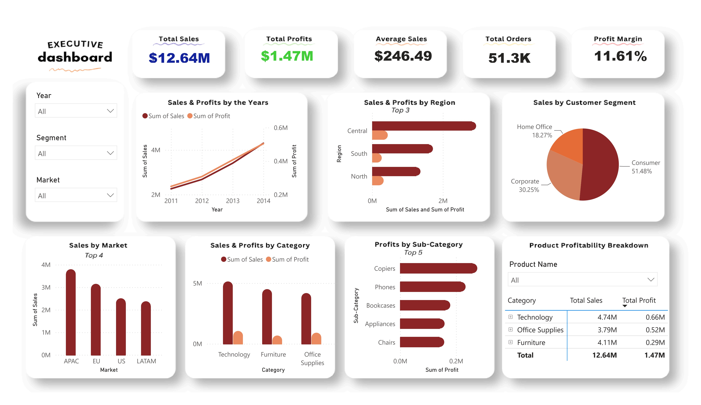

# Global-Superstore Analysis
A national retail company needed a way for senior management to monitor sales performance, profitability, customer behavior, and regional performance without relying on manual reporting. 

This project delivers an interactive Power BI dashboard that turns raw transactional data into actionable insight, answering seven core business questions:
- What is the overall sales performance of the company?
- Which regions generate the highest sales and profit?
- Which customer segments contribute the most revenue?
- Which product categories perform best?
- Which products are the most profitable?
- What trends can be observed over time?
- What should management implement to improve performance?

# Dataset
Global Superstore Dataset from Kaggle.

# Key Insights
- Sales grew 90% from 2011 to 2014 ($2.26M → $4.30M); profit grew even faster (+103%)
- The Central region and APAC market are the strongest performers by sales and profit
- Technology is the most profitable category (14% margin) vs. Furniture's 6.9%
- Sales show strong Q4 seasonality — more than double Q1 volume every year
- The Tables sub-category is unprofitable overall due to heavy discounting

# Tools & Skills Used
- Microsoft Power BI — Power Query (data cleaning & transformation), DAX (measures), interactive dashboard design
- Data cleaning — missing value checks, duplicate removal, data type correction
- Business analysis — KPI definition, trend analysis, segment/category/regional profitability analysis
- Communication — translating analytical findings into business insights and recommendations for a non-technical executive audience

For the full write up, see the Executive Summary Report.
